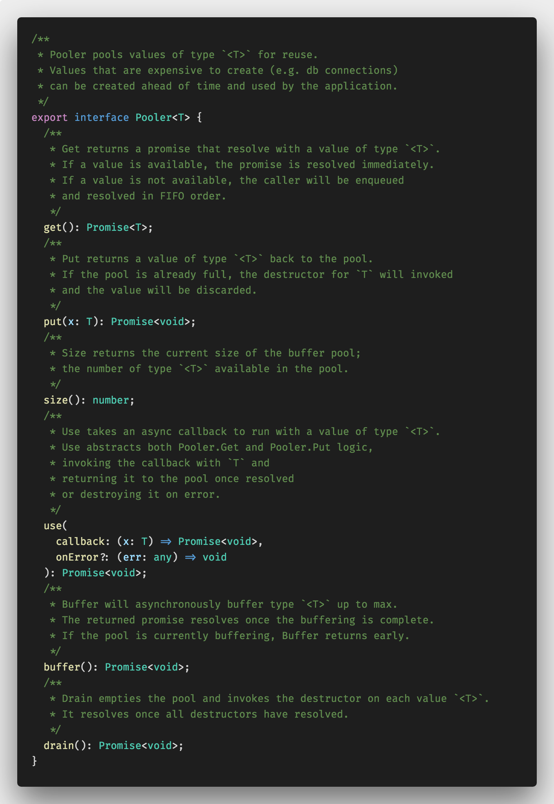
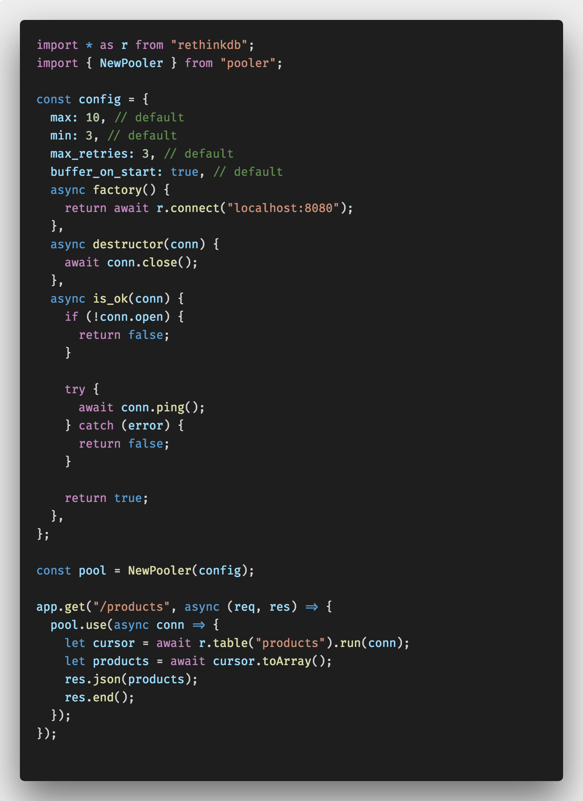

# Pooler

A generic pooling interface and TypeScript/JavaScript implementation.

## The interface

The heart of `pooler` is the interface. The interface is largely taken from the
Go standard library where the two key methods are `get` and `put`.

Unique to this library is the method `use`. The `use` method is a convenience
feature that abstracts the logic of both `get` and `put` by passing in a
callback to be executed with a value from the pool. This is especially nice for
making single queries to a database. It removes the need for a lot of
boilerplate code, and also removes the possibility you forget to put the value
back in the pool.

## Basic Usage

To get started, created a pooler from the implementation's option object.

